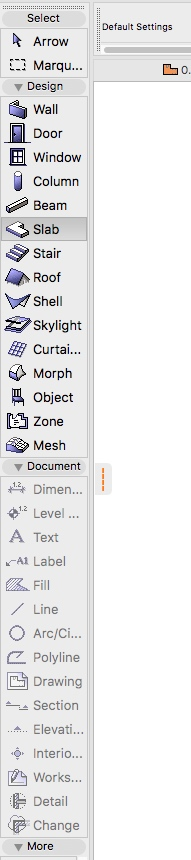
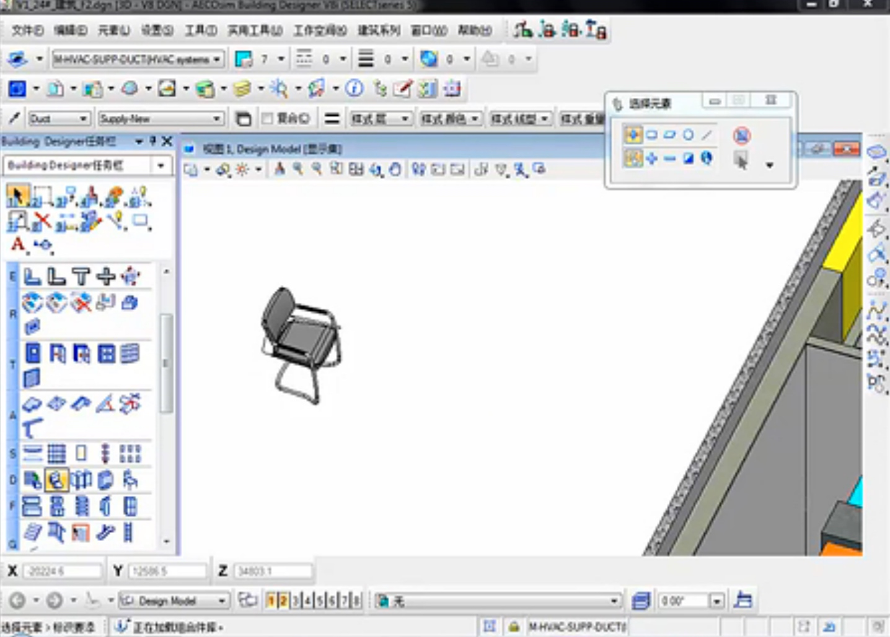
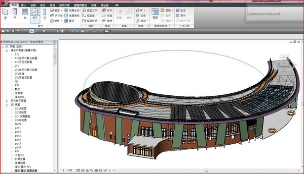

## BIM软件工程设计比较性研究


#### BIM软件与传统软件对比？

```
信息化

1.所绘即所得
	与su/rhino等最大的区别，板片块体都是有意义的(背后代表墙/窗等)，计算机能理解的。可以提高效率，设计修改方便，比如说平立剖对不上的问题。
	
2.插件式工作流
	设计过程中的节能分析，碰撞检测。同时可整合一些固定的流程，例如成本计算，经济指标控制，门窗表，构建化等。
	《基于BIM的建筑设计阶段的碳足迹模拟计算》成功大学
	
3.协同
	水暖/结构/室内类似于bentley同一平台整合。建筑全生命周期(设计，施工，运维管理)统一，减少工作量及提高协同效率
	
4.规范标准信息化
	统一的IFC标准，对于审计、审图、消防等可用信息化自动化方式处理
	《BIM软件的IFC相容性研究：以设施管理应用为例》
	
5.模糊化
	草图到su到施工，bim怎么做
	
bim背后的思想
```


####  各软件区别？

```
通过BIM软件的建筑下思潮

似乎仅仅是对于起步不同但BIM软件殊途同归？不太容易深入

1.软件设计初衷
	archiCAD是在1984年便推出的产品，起初的目标很简单，就是通过其"虚拟建筑"（类似于现在BIM概念）手段，辅助 设计师 设计。这么多年演化下来依然保持其纯粹性，十分适合 建筑设计 领域，符合建筑师传统思考方式（例如视图组织、功能设计、BIMx展示），对于CAD的支持非常好（例如都有图层的概念），支持GH。
	revit是2002年有autodesk公司收购的一款机械设计软件，建筑设计是作为其软件改造逐渐实现的，因此产品大而全，功能也非常冗杂。由于其平台大且开放，吸收各产品，产生了类似GH的dynamo，以及各专业BIM软件，MEP方面很好，二次开发的插件也很完善。
	bentley也是1984年成立，与archiCAD不同，其发展出了建筑行业极其庞大的协作平台，涵盖工厂，GIS，交通，基建，结构，建筑。MEP的功能非常全，一个软件所有工种都能用。从二维时代过渡到三维时代也没有迁移成本。由于其也是专业的建筑设计软件(v8)，加上参数化软件(GC)，与archiCAD的设计能力相媲美。然而其涵盖全，系统复杂，入门门槛高。
	
2.用户诉求
	国内BIM的使用群体主要是大型设计院，从前期到施工跟完，且比较看重数据管理功能。于是类似于revit和bentley这类协作非常好，一个软件就能协调所有专业比较适合。类似于archiCAD着重于建筑设计领域的发展不好
	
3.功能性比较
	非常多且都是细节。。。
	+ 族概念的取舍
	+ 尺寸锁定功能
	+ 图层概念取舍
	+ 多窗口支持
	+ 曲面nurb支持程度
	+ 文档管理
	+ 二次开发插件多寡
	+ 与其他软件兼容性(IFC方面)
	
4.对建筑师方案设计的影响
	？？？
	概念设计，方案深化，扩初，施工图
```


#### 问题整理

```
1、如何与建筑设计思维融合？(BIM如何辅助设计师想象空间: BIM与SU/Rhino是否有不同、BIM如何与建筑文化浪潮相关，不同软件又是以什么姿态扮演什么角色)
2、软件不同的功能、操作方法、设计惯性影响下的建筑设计思路区别(由功能出发)
3、形成此区别背后的原因分析，最好能上升至建筑思维浪潮层面(例如对于异形建筑的追求，日益碎片化的建筑风格)
4、基于不同软件的实际案例操作区别
5、学生、设计院、事务所之于软件选型现状及参考意见

bentley没有图层概念，是因为图层本来就是不属于建筑师考虑范畴的东西
```


#### 问题细化

```
**仅限于 建筑设计/空间设计 层面，剔除协同及施工**
软件对比相关
1、各软件主要的区别是什么？(功能设置，概念抽象(族、图层、构件))
2、这些区别是如何影响建筑设计的过程与思路？
3、为什么会形成这些区别？
4、如何评价这些区别？
5、**是否软件只是对于偏向施工的技术人员比较有意义，设计总监很少推崇（MAD也不用）？是否是着重于图纸深化，对于建筑学核心内容并没太多牵涉？**


bim概念相关
1、BIM对于建筑设计过程的辅助作用，对于su/rhino是否有思路升级？(二维三维并行)
2、BIM软件与当今建筑思潮有什么关系？为何这么火（总承包公司）？对于（国外的建筑模式/学生设计）为何需要BIM的软件辅助（项目整体协调人员）？
3、对于充分接收互联网思维的新一代建筑师，BIM是否有其适应性？(是个持续集成可重复修改可深化的模型)
4、BIM在建筑设计经验沉淀方面是否适合？
5、从实验到项目的过程是否适合？实验式建筑到项目设计
6、学生、设计院、事务所之于软件选型现状及参考意见


主要是绘图调整效率增加，但是如何帮助设计师进行空间思考？
bentley就是高级工具箱


revit模型是一个整体不能拆分？（工程不好用）和设计有什么关系？
```









## BIM管控规定制定及可行性研究

